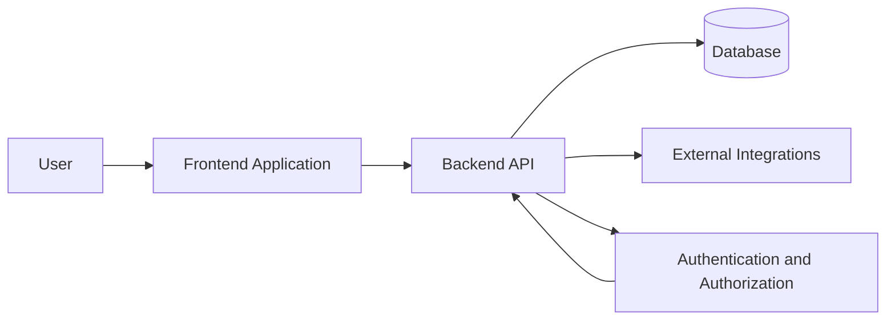
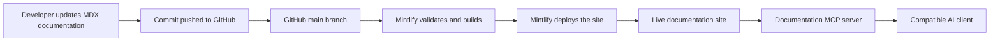

The Rejesha Green platform is organized into presentation, application, data, security, and integration layers. GitHub is the source of truth for documentation, while Mintlify provides the publishing layer.

## High-level platform flow

## Documentation delivery workflow

