The **Rejesha Green** platform infrastructure is engineered around a completely decoupled, modular multi-tier topology. This isolation ensures independent scale limits, sandboxed deployment pipelines, and zero downtime cross-layer operational boundaries.

---

## Complete Functional Architecture Topology

This operational blueprint tracks exactly how system transactions are generated across client apps, authenticated via firewalls, processed by computing nodes, and committed to database infrastructure:

```mermaid
flowchart LR
    %% User Access Matrix
    subgraph Users["👥 Client Access Matrix"]
        direction TB
        Admin["🔒 Admin Portal"]
        Client["📱 Mobile App Client"]
        Agent["💻 Field Agent View"]
    end

    %% Presentation Layer
    subgraph Presentation["🎨 Presentation Layer (docs/frontend)"]
        direction TB
        router["📍 Route Manager"]
        state["⚡ State Engine"]
        view["📦 View Components"]
        
        Admin & Client & Agent --> router
        router --> state --> view
    end

    %% Network Security Gateways
    subgraph Security["🛡️ Security & Authentication Layer"]
        direction TB
        gate["🔒 HTTPS API Gateway"]
        jwt["🔑 JWT Token Filter"]
        rbac["👤 RBAC Scope Validator"]
        
        view -->|Secure Payload Request| gate
        gate --> jwt --> rbac
    end

    %% Application Core
    subgraph Application["⚙️ Core Application Tier (docs/backend)"]
        direction TB
        engine["🚀 Core Process Engine"]
        valid["✅ Input Validator"]
        notify["🔔 Event Dispatcher"]
        
        rbac -->|Authorized Execution| valid
        valid --> engine
        engine --> notify
    end

    %% Persistent Storage Clustered
    subgraph Data["💾 Persistent Storage Tier"]
        direction TB
        db[("🗄️ Relational Database")]
        cache[("⚡ Active Cache Tables")]
        
        engine <-->|CRUD Query Sync| db
        engine <-->|Session Key Store| cache
    end

    %% Custom Cosmic Purple Design Tokens Mapping
    classDef layerBox fill:#0F0826,stroke:#4C1D95,stroke-width:2px,color:#fff;
    classDef nodeBox fill:#1E1145,stroke:#7C3AED,stroke-width:1px,color:#E9D5FF;
    classDef dataBox fill:#0B061A,stroke:#A78BFA,stroke-width:2px,color:#fff;
    
    class Users,Presentation,Security,Application layerBox;
    class Data dataBox;
    class Admin,Client,Agent,router,state,view,gate,jwt,rbac,engine,valid,notify,db,cache nodeBox;
```

---

## Infrastructure Operations Matrix

Our decoupling policy isolates operational domains to ensure high platform predictability:

<CardGroup cols={2}>
  <Card title="Client Presentation Layer" icon="browser" href="/frontend">
    Governs user interface views, cross-device application layout modules, navigation graphs, and localized client-side state models.
  </Card>
  <Card title="Application Processing Layer" icon="gears" href="/backend">
    Powers central logic engines, schema calculation rules, integration webhooks, and core data formatting pipelines.
  </Card>
  <Card title="Persistent Data Storage Layer" icon="database">
    Maintains active user profiles, operational history audit records, cached session keys, and database clustering environments.
  </Card>
  <Card title="Zero-Trust Security Layer" icon="key" href="/security">
    Enforces perimeter route validation filters, strict JWT token checks, RBAC authorization keys, and transactional logs.
  </Card>
</CardGroup>

---

## Request Execution Pipeline Timeline

Every cross-environment platform request operates chronologically along a single-direction, verifiable transaction roadmap:

<Steps>
  <Step title="1. Action Event Capture">
    An admin or field agent executes an activity trigger. The frontend application intercepts the state and packs the transaction variables.
  </Step>
  <Step title="2. Secure Ingestion Pass">
    The packed array parameters transit via encrypted HTTPS network channels down to the core platform API Gateway.
  </Step>
  
    The security gateway intercepts the transmission, parsing user tokens to check system context permissions before passing down logic tasks.
  </Step>
  <Step title="4. Persistent State Execution">
    The processing nodes commit structural updates directly to the database engines, saving configurations and triggering automated alert updates.
  </Step>
</Steps>

<Info>
  **Systems Notice:** Security configurations require that all node interactions passing between the server clusters maintain active encryption protocols.
</Info>
